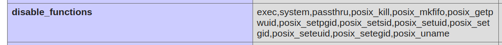
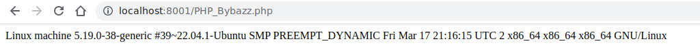
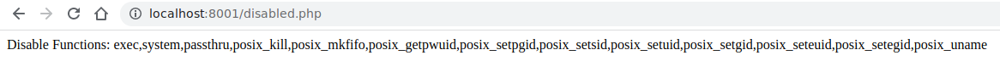

# :boom: PHP_Bybazz

> PHP_Bybazz: A PHP Bypass Tool for Executing Commands Regardless of Restrictions!

> PHP_Bybazz is a powerful PHP bypass tool that allows you to execute commands regardless of any restrictions. Whether you're dealing with a restricted environment or facing limitations in executing commands, PHP_Bybazz comes to the rescue. With its robust features and capabilities, PHP_Bybazz empowers developers and security researchers to overcome limitations and perform tasks that would otherwise be restricted.

> One of the key features of PHP_Bybazz is its ability to bypass command execution restrictions in PHP environments. This tool provides a simple yet effective way to execute commands even in situations where PHP configurations or restrictions may prevent direct command execution. This makes PHP_Bybazz a valuable asset for tasks such as penetration testing, vulnerability assessment, and debugging.

---

## :scroll: Usage

### To use PHP_Bybazz, upload the codes under the SRC folder to the system and run them.

> If any of the following functions are not disabled, the code will run correctly:

```bash
"exec, shell_exec, passthru, system, pcntl_exec, proc_open, fread/popen"
```

## :scroll: Details

### If they are not functioning, you can explore the exploits coded by mm0r1 in the "exploits" folder and try running them based on the PHP version of the target system.

## :scroll: Screenshots

---



---



---



---

> #### Created by 0x1717 aka GYG3S
